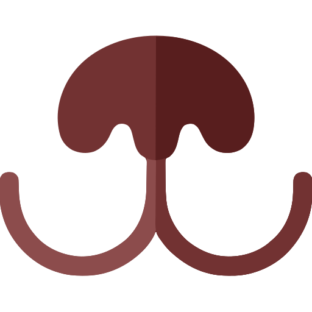
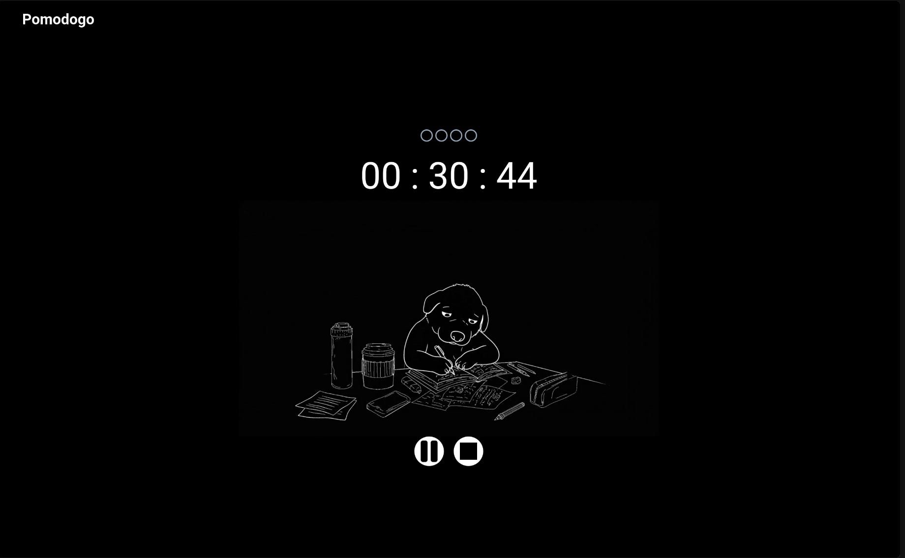
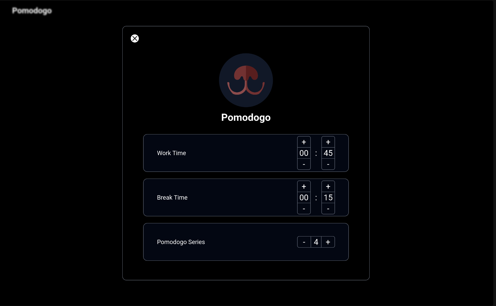

# PomoDogo

<div align=center>
    
</div>

~~~
PomoDogo is a project focused on helping you concentrate using Pomodoro techniques. A clean website, free from distractions, and best of all... dogs!
~~~

## Contents
- [PomoDogo](#pomodogo)
  - [Contents](#contents)
  - [Preview](#preview)
    - [Homepage](#homepage)
    - [Settings](#settings)
  - [Technologies Used](#technologies-used)
  - [Usage](#usage)
  - [Contacts](#contacts)
  - [License](#license)


## Preview

### Homepage

<div align=center>
    
</div>

### Settings

<div align=center>
    
</div>


## Technologies Used

<div align="center">
  <a href="https://developer.mozilla.org/pt-BR/docs/Web/JavaScript" target="_blank"></img></a>
  <a href="https://vite.dev/" target="blank"></a>
  <a href="https://react.dev/" target="_blank"></img></a>
  <a href="https://tailwindcss.com/" target="_blank"></a>
</div>

## Usage
1. Copy and paste in bash:

```bash
git clone https://github.com/Rafaelszc/PomoDogo.git

cd PomoDogo/
```

2. Install dependencies

```bash
npm install
```

3. Run project

```bash
npm run dev
```

## Contacts

<div align=center>
    <a href="https://github.com/Rafaelszc"></a>
    <a href="mailto:rafaelszccontato@gmail.com"></a>
    <a href="https://www.linkedin.com/in/rafael-souza-5461762b8"></a>
</div>

## License

[MIT License](LICENSE)

©2025, por Rafael Souza. All rights reserved.